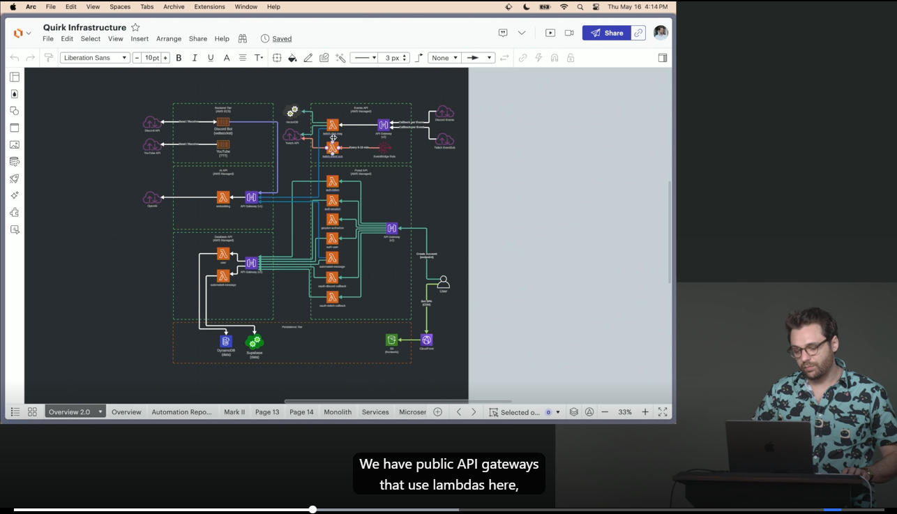

## Introduction to Backend Architectures
#### Slide
- https://alt-f4-llc.github.io/fem-bsda-presentation/slides.html

#### Quirk Infra

##### Conclusions
###### Importance of Systematic Planning
Effective architecture design is foundational to project success.
Emphasize the necessity of thorough planning and understanding of
both stakeholder needs and technological capabilities before initialing
development.
`This ensures alignment with business objectives and user requirements, optimizing
 both functionality and efficiency`

###### Flexibility and Scalability are Key
In the ever-evolving landscape of technology and business, designing
architecture with flexibility and scalability at its core is crucial.
`These allow a system to adapt to changes in user demand and technological
 advancements without requiring complete redesigns, thereby saving time, resources,
 and facilitating sustained growth.`

###### Continuous Learning and Adaptation
The field of architecture design is dynamic, with new challenges
and solutions emerging regularly. Embrace a mindset of 
continuous learning and openness to innovation.
`This approach will not only keep your skills relevant but also enable
 you to design systems that are robust, adaptable, and forward-thinking.`