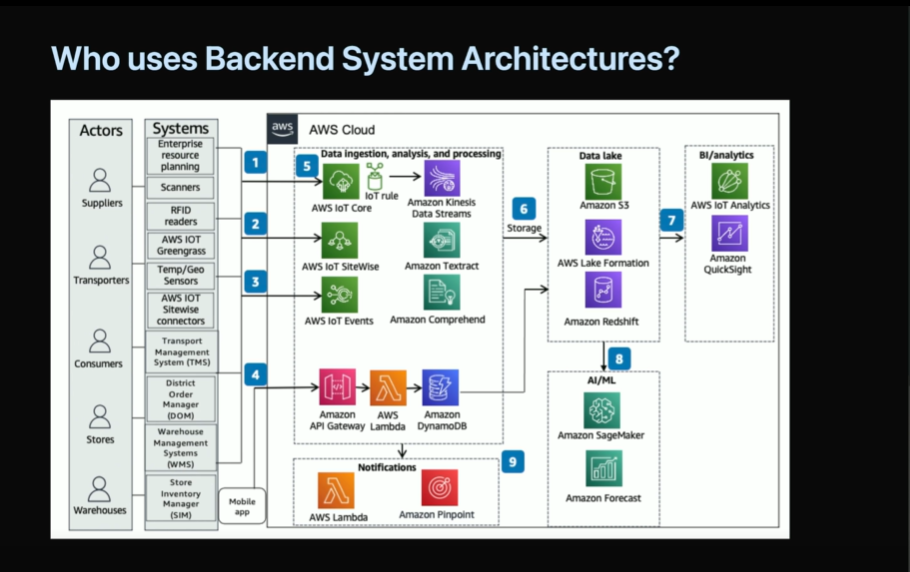
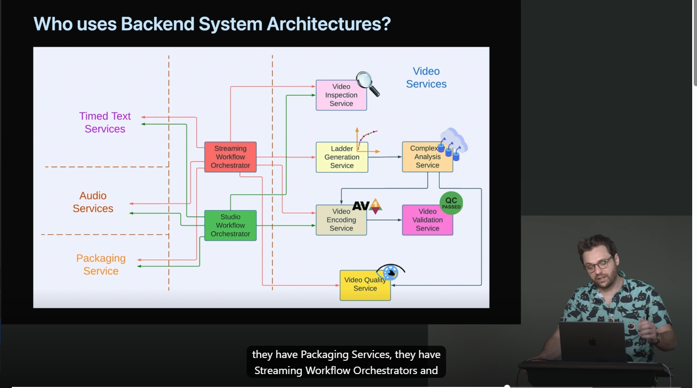

## Who uses Backend System Architectures?
### Amazon
Utilizes a microservices architecture to manage its
vast operations. Each microservice functions
independently, facilitating teams to modify their services
without affecting others. This approach has propelled Amazon's
scalability and innovation.
dogfooding -> build an architecture -> reuse to other architecture

#### Netflix
Netflix employs a hybrid of serverless and microservices architectures
to provide streaming services to millions of users globally. This 
architecture enables Netflix to manage enormous traffic
surges and deliver a smooth user experience.

Netflix Cosmos
Cosmos is a computing platform that combines the best aspects of 
micrservices with asynchronous worksflows and serverless functions

