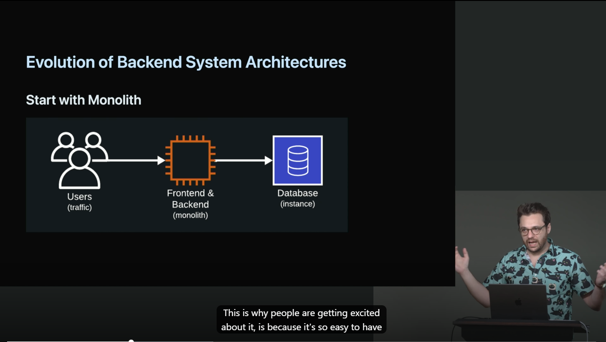
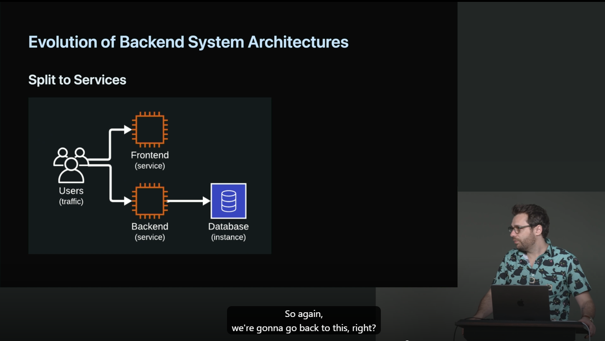
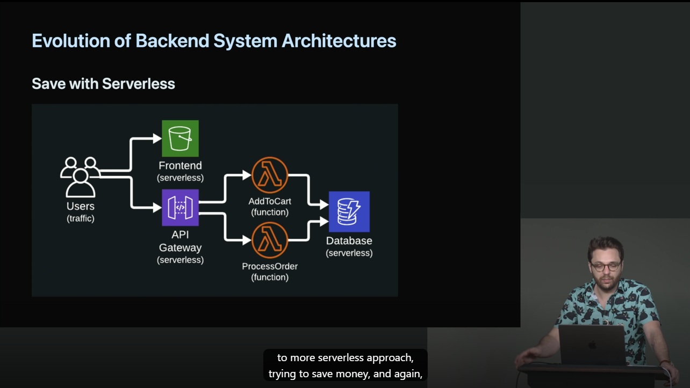

## Evolution of Backend System Architecture
### Start with Monolith
Most companies and/or projects start with a monolith design 
for the same benefits mentioned earlier:
- Simplicity
- Consistency
- Efficiency
- users (traffic) -> Frontend & Backend (monolith) -> Database (instance)

### Split to Services
After a company or projects grows there begins the need to "split out" functional logic
into units for the following benefits:
- Independent Development
- Independent Deployment
- Fault Isolation
- users (traffic) -> frontend (service)
- users (traffic) -> backend (service) -> database (instance)

#### Save with Serverless
After starting with a monolith, then separating logic with 
services, a system can further benefit from serverless for:
- No infrastructure management (saves operations costs)
- Costs based on usage (saves resource costs)
- Automated scaling (saves scaling challenges)

- users (traffic) -> frontend (serverless)
- users (traffic) -> API Gateway (serverless) -> AddToCart (function) -> Database (serverless)
- users (traffic) -> API Gateway (serverless) -> ProcessOrder (function) -> Database (serverless)
