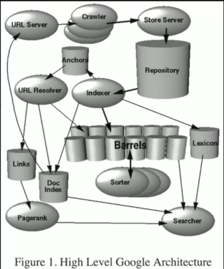
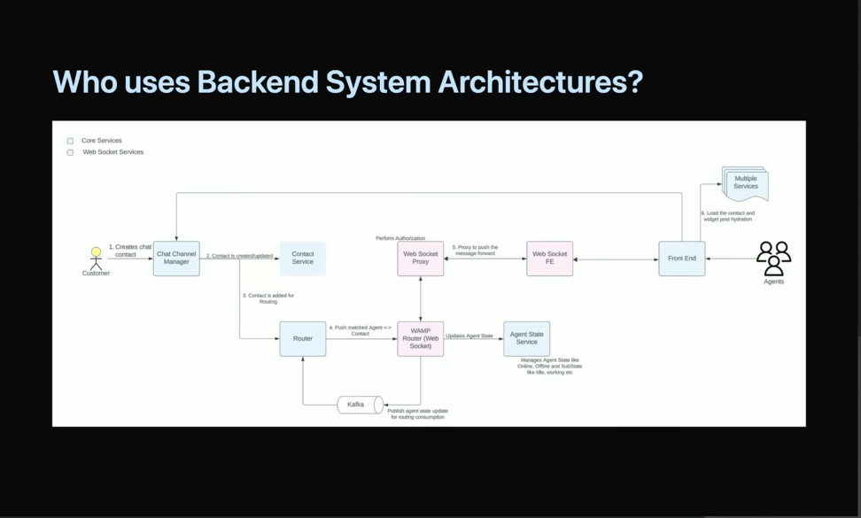

## Who uses Backend System Architectures?
### Google
Google's search backend engine uses concepts such as monolithic architecture, service-
oriented architecture (SOA), and microservies, each of which represents stages in the 
evolution of backend architectures.
Search Engine

#### Uber

As it expanded worldwide, Uber transitioned from a monolithic to a 
microservices' architecture. Each service, such as ride-hailing, 
food delivery, and driver-partner services,
is managed by a separate microservice. This has enabled Uber to scale 
and customize its service for different markets.

